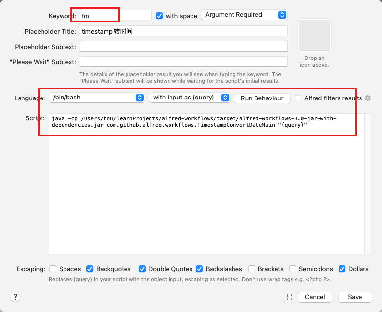
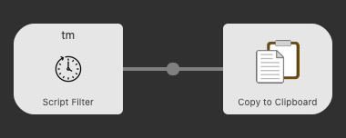

# alfred-workflows

使用Java实现的一些简单的Alfred工作流

## ✨ 特性
- 🌈  可以实现Linux时间戳转换成时间（yyyy-MM-dd HH:mm:ss）的字符串
- 🔥  将时间字符串转换成时间戳
- 🎁  获取当前时间戳
- 🛡  获取当前时间字符串

# ⏬ 下载使用

## 1、下载下载并编译这个项目

## 2、在Alfred中创建一个空的工作流

配置工作流触发方式和启动脚本



启动命令需要按照你下载编译的路径替换下

```shell
java -cp {projectPath}/target/alfred-workflows-1.0-jar-with-dependencies.jar com.github.alfred.workflows.TimestampConvertDateMain "{query}"
```

## 3、Workflows节点配置


* 第一个节点为Script Filter类型，支持使用命令触发开发的脚本。
* 第二个节点为将上一个节点的处理结果复制到剪切板

# 效果展示
